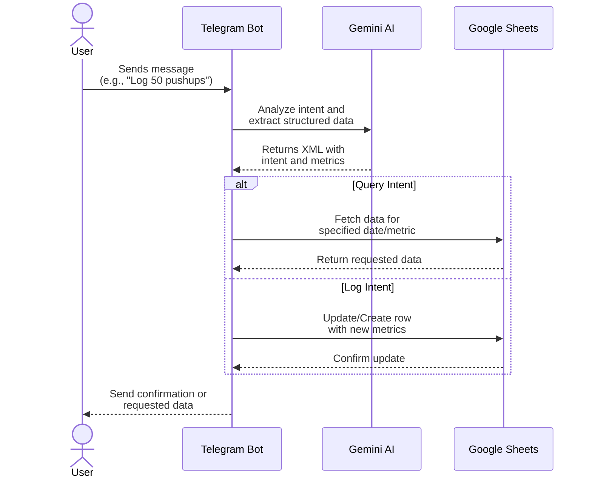

# OnePercentBetter

This is a Health AI Agent that helps track fitness in google sheets. You can ask it to log things. You can also ask it questions about previous data.

## Current Features

- Log pushups, steps, sleep score, sleep duration, and workout status
  - `Log 10,000 steps for today`
- Increment pushups or steps
  - `Add 10 pushups`
- Query pushups, sleep score, steps, and workout status
  - `What was my sleep score yesterday?`

## Limitations / Potential Improvements

- Does not handle multi-turn conversations.

### Architecture



## Operating Instructions

### Set Required Environment Variables
- `GEMINI_API_KEY`: Your Google Gemini API key
- `TELEGRAM_BOT_TOKEN`: Your Telegram bot token
- `AUTHORIZED_USERS`: A comma-separated list of user IDs of those authorized to use the bot

### Create Google Sheets API Service Account JSON File
- Create a service account in the Google Cloud Console
- Download the JSON key file and save it as `OnePercentBetter Google Sheets.json` in the root directory
- Share the spreadsheet with the service account email address found in the JSON file (`client_email` field)

### Run Without Docker

```bash
python -m venv venv
source venv/bin/activate
pip install -r requirements.txt
python OnePercentBetter.py
```